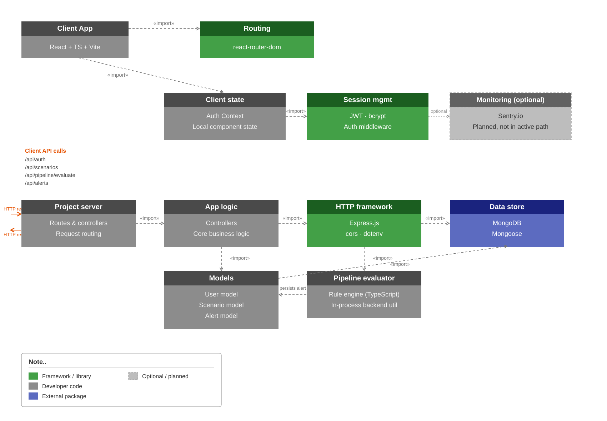

# FinGuard — Financial Crime Scenario Builder

A full-stack monorepo application for defining custom alert scenarios, 
processing transactions through a rule-based pipeline, and investigating 
flagged activity in real time.

> Currently in development — Day 9 of build log below.

---

## Author

Built by **Syed Aaqil Abbas**  
MASc Software Engineering — Memorial University of Newfoundland

- Portfolio: [syedaaqilabbas.vercel.app](https://syedaaqilabbas.vercel.app)  
- GitHub: [github.com/saabbas572](https://github.com/saabbas572)

---

## Planned Stack

React · TypeScript · Vite · Node.js · Express · 
MongoDB · Python · FastAPI · Docker · Sentry · AWS · GitHub Actions

---

## API Documentation

Complete API documentation is available for all endpoints:

- **[OpenAPI/Swagger Spec](docs/SWAGGER_DOCS.yaml)** — Interactive API documentation
  - View at [Swagger Editor](https://editor.swagger.io/)
  - Copy-paste the YAML content to explore endpoints interactively
  
- **[Comprehensive API Guide](docs/API_DOCS.md)** — How-to guide with examples
  - Authentication flows
  - Common workflows
  - Error handling
  - Testing checklist
  
- **[Postman Collection](docs/POSTMAN_COLLECTION.json)** — Pre-configured API requests
  - Import into Postman for automated testing
  - Auto-capture tokens and IDs from responses
  - Test all endpoints with example payloads

**Quick links to API endpoints:**
- Authentication: `POST /auth/register`, `POST /auth/login`
- Scenarios (Rules): `POST/GET/PUT/DELETE /scenarios`
- Pipeline: `POST /pipeline/evaluate`
- Alerts: `GET/PATCH/DELETE /alerts`, `GET /alerts/stats`

---

## Architecture Diagram

The diagram illustrates the FinGuard monorepo architecture. The React frontend in `client/vite-project` communicates with the Express backend under `server`, while the `pipeline` directory is reserved for the future Python transaction-processing service. MongoDB stores user and alert data, and Docker is used to compose the frontend, backend, and database services. The diagram also highlights external integrations for monitoring, auth, and data pipelines at a high level.

---

## Development Log

### Day 1 — Monorepo Scaffold & Project Initialization
**Date:** June 10, 2026

Initialized the monorepo using npm workspaces with `client` and `server` 
workspaces and a `pipeline` directory reserved for the Python service. 
Added `concurrently` at the root to run both services in parallel with 
a single command.

Scaffolded the client using Vite with the React TypeScript + SWC template. 
Installed Redux Toolkit, React Router, and Axios.

Scaffolded the server with Express, Mongoose, JWT, bcrypt, dotenv, and cors. 
Configured TypeScript with `ts-node` and `nodemon` for development.

Created `docker-compose.yml` to orchestrate MongoDB, the Node.js backend 
on port 5000, and the React frontend on port 3000.

**Libraries added today:** `react`, `react-dom`, `typescript`, `vite`, 
`@vitejs/plugin-react-swc`, `@reduxjs/toolkit`, `react-redux`, 
`react-router-dom`, `axios`, `express`, `mongoose`, `jsonwebtoken`, 
`bcryptjs`, `dotenv`, `cors`, `ts-node`, `nodemon`, `concurrently`

**Next:** MongoDB connection, User model, first auth route (`/api/auth/register`)

**What I learned:**
- How to organize a TypeScript monorepo with separate frontend and backend workspaces.
- How to scaffold a Vite React app and an Express server together.
- How to use Docker and `concurrently` to run both services locally.

### Day 2 — Auth API + MongoDB Integration
**Date:** June 11, 2026

Connected the Express backend to MongoDB using `mongoose` and environment-based URI configuration. Added a `User` model with `name`, `email`, hashed `password`, `role`, and timestamps.

Implemented `/api/auth/register` and `/api/auth/login` routes with password hashing via `bcryptjs`, JWT issuance with `jsonwebtoken`, and controller logic for registration and login.

Added `/health` for service readiness, plus server startup configuration with `dotenv`, `cors`, and JSON body parsing.

**Completed today:** Backend auth flow, database integration, user schema, register/login controllers, and API routing.

**Next:** Protected routes, Redux auth slice, and scenario builder UI.

**What I learned:**
- How to connect Express to MongoDB with Mongoose and handle env-based configuration.
- How to build registration and login flows with bcrypt password hashing and JWT authentication.
- How to structure controllers and API routes for auth functionality.

### Day 3 — Tailwind Integration & Auth UI
**Date:** June 12, 2026

Installed Tailwind CSS into `client/vite-project` and added PostCSS configuration so Vite can process Tailwind utilities.

Configured `tailwind.config.js` to scan `./index.html` and `./src/**/*.{js,ts,jsx,tsx}`. Imported Tailwind directives in `src/index.css` and used `@apply` for shared auth-card layout styles.

Updated the login and register pages to use Tailwind utility classes directly in JSX, including responsive layout, styled input fields, and button states.

**Completed today:** Tailwind install, Tailwind/PostCSS config, global Tailwind CSS setup, and login/register page styling.

**Next:** Extend the Tailwind-based design system to dashboard components, add auth form validation feedback, and build the scenario builder interface.

**What I learned:**
- How to install and configure Tailwind CSS in a Vite React application.
- How to use Tailwind utility classes for responsive auth page layout and styling.
- How to integrate PostCSS and keep styles maintainable with shared utility classes.

### Day 4 — Protected Routes & Auth Integration
**Date:** June 13, 2026

Started implementing auth middleware and protected backend routes for the Express API. Added a Redux auth slice in the client and connected login/register forms to the backend auth API.

Created protected client routes with route guards, and began scaffolding the dashboard layout that will host the scenario builder. Added client-side form validation feedback for login and registration, with a cleaner summary-based UI and invalid-field highlighting.

**Completed today:** Auth middleware, protected API route structure, Redux auth slice, frontend auth flow wiring, protected dashboard route, and auth form validation/feedback.

**Next:** Complete dashboard pages, build scenario/rule creation UI, and expand the protected scenario builder interface.

**What I learned:**
- How to protect Express routes with JWT auth middleware.
- How to manage auth state in Redux and connect it to the React app.
- How to create protected client routes for authenticated pages.
- How to add validation feedback without cluttering the auth form UI.

---

### Day 5 — Scenario Builder & Dashboard Expansion
**Date:** June 15, 2026

Added a protected Scenario Builder page to the React frontend and wired it into routing. Built a local scenario template editor that saves rules in local storage, with category selection, condition input, threshold entry, and active/inactive status.

Updated the dashboard to link to the new scenario builder and refined the next-steps section to reflect rule-template creation.

**Completed today:** Scenario Builder page, protected `/builder` route, dashboard navigation, local scenario persistence, and updated development log.

**Next:** Add backend scenario storage, build rule execution pipelines in `pipeline`, and surface rule metrics with dashboard charts.

**What I learned:**
- How to structure a scenario builder UI for alert rule creation.
- How to persist user-defined templates client-side with localStorage.
- How to connect feature navigation between dashboard and builder pages.

---

### Day 6 — Scenario API & Full Scenario CRUD
**Date:** June 16, 2026

Built backend scenario persistence and connected it to the frontend scenario builder UI. Added a `Scenario` Mongoose model, RESTful scenario routes, controller logic, and protected route access using JWT auth middleware. Completed the frontend integration with a `scenarioService`, Redux `scenarioSlice`, scenario list page, and create/edit modal form.

**Completed today:** Backend scenario storage, full CRUD API (`POST`, `GET`, `PUT`, `DELETE`, `PATCH /toggle`), frontend Redux flow, scenario UI components, parameter editing, and API documentation.

**Next:** Integrate rule execution into the `pipeline` service, add dashboard metrics/analytics for scenario performance, and build story-driven rule notifications.

**What I learned:**
- How to wire a full CRUD feature end-to-end between frontend and backend.
- How to manage scenario state with Redux and keep UI in sync with API updates.
- How to build a reusable form component for create/edit workflows.

---

### Day 7 — Rule Pipeline Engine & Alert System
**Date:** July 5, 2026

Built the core transaction evaluation pipeline and alert storage system. Added a `/api/pipeline/evaluate` endpoint that evaluates transactions against active user scenarios, applying threshold-based rules. Implemented a comprehensive Alert model, CRUD API, and alert stats tracking. Updated the dashboard to display live alert metrics instead of hardcoded data. When scenarios are triggered, alerts are automatically persisted to the database and surfaced to the user in real time.

**Completed today:** Rule engine logic with threshold evaluation, pipeline controller and routes, Alert Mongoose model, alert management API (`GET`, `PATCH /resolve`, `DELETE`, `/stats`), alert service for frontend, dashboard integration with live alert counts and alert list display, parameter input UX fix (focus issue).

**Tested:** End-to-end alert flow (create scenario → evaluate transaction → alert stored → dashboard updated), server tests passing, frontend build successful.

**Today’s steps:** Build a dedicated Alerts management page, expand rule logic beyond amount thresholds, add real transaction data ingestion from payment APIs.

**What I learned:**
- How to build a rule evaluation engine with flexible parameter checking.
- How to wire automatic alert persistence when rules trigger.
- How to keep dashboard data real-time instead of using mocked data.
- Importance of proper React key management to prevent input focus loss.

---

### Day 8 — Alerts UI, Expanded Rule Logic, and Sample Ingestion
**Date:** July 11, 2026

Built a dedicated Alerts management experience for reviewing, filtering, resolving, and deleting alerts. Added a sample-transaction evaluation card to the Alerts page so users can submit amount, type, country, and merchant values and immediately run the current rule engine against them.

Expanded the backend pipeline beyond simple amount-threshold checks to support amount-range logic (min/max), blocked-country checks, blocked-transaction-type checks, and multi-condition evaluation. Added a lightweight local ingestion helper that feeds sample transactions into the pipeline so the app can demonstrate end-to-end alert evaluation without depending on a live payment API connection.

Updated the frontend summary output to show the names of all triggered scenarios after evaluation and surfaced the rule configuration inputs in the scenario form for amount ranges and blocked values.

**Completed today:** Dedicated alerts page, sample transaction evaluation flow, expanded rule engine configuration, triggered-scenario names in evaluation summary, local sample-ingestion helper, and updated frontend/backend validation.

**Next:** Add richer mock transaction history, support velocity and pattern-based rules, and optionally wire a real provider integration later.

**What I learned:**
- How to expose evaluation results in the UI without losing the alert-management workflow.
- How to structure rule parameters so multiple condition types can be evaluated consistently.
- How to keep the product demo-ready even when live ingestion is unavailable by using a local sample-ingestion path.

---

### Day 9 — Real Payment Provider Integration & Dynamic Severity Levels
**Date:** July 13, 2026

**Part 1: Payment Provider Integration**

Built a complete payment provider integration system supporting Stripe, PayPal, Square, and custom APIs. Created a provider adapter architecture with a factory pattern to instantiate the correct provider based on configuration. Each adapter normalizes provider responses into a standardized transaction format.

Added a backend `Integration` model to persist provider credentials (encrypted at rest), along with a full CRUD API (`GET`, `POST`, `DELETE`, `/test`) for managing integrations. Implemented connection testing for each provider to validate credentials before saving.

Built a comprehensive **Integration Settings page** in React where users can:
- Select a payment provider (Stripe, PayPal, Square, or custom)
- Enter provider-specific credentials (API keys, access tokens, etc.)
- Test the connection before saving
- Manage multiple integrations and activate/deactivate them
- View helpful links to get provider credentials

Wired the integration system to the pipeline by adding a `/api/pipeline/evaluate-integration` endpoint that:
- Fetches the active integration for the user
- Uses the provider adapter to retrieve real transactions
- Evaluates all transactions against active scenarios
- Creates alerts for matched transactions
- Returns a summary of evaluations and alerts created

**Part 2: Stripe Customer Data & Dynamic Severity**

Fixed Stripe API integration to properly fetch customer data using correct expand syntax:
- Single charge endpoint: `GET /v1/charges/:id?expand[]=customer`
- List charges endpoint: `GET /v1/charges?expand[]=data.customer`

Implemented dynamic severity levels (low, medium, high) throughout the system:
- Added `severity` field to `Scenario` model (MongoDB)
- Updated scenario creation form to allow users to select severity level
- Modified pipeline evaluation to use user-defined severity instead of hardcoded 'high'
- Auto-polls every 10 seconds with no manual clicks required
- Customer names and emails now properly populate in alerts from Stripe

**Completed today:** 
- Integration model and CRUD API, provider adapter system (Stripe, PayPal, Square, Custom)
- Connection testing for each provider, Integration Settings UI page
- Fixed Stripe API expand parameter syntax for customer data retrieval
- Dynamic severity levels in scenarios with user-configurable UI
- Auto-evaluation every 10 seconds with real transaction data
- Transaction details page showing complete customer and transaction information
- Duplicate alert prevention from repeated evaluations
- End-to-end testing with real Stripe test transactions ($150, $9000+ CAD)

**Tested:** 
- Provider connection tests for each type, integration CRUD operations
- Real Stripe transaction detection and alert creation
- Auto-polling detects new transactions within 10 seconds
- Severity levels correctly applied based on user scenario configuration

**Next:** 
- Webhook handling for real-time transaction ingestion
- Scheduled jobs for periodic transaction fetching
- Advanced fraud detection (velocity, email domain risk, IP geolocation)
- Machine learning anomaly detection for fraud scoring

**What I learned:**
- How to design a provider adapter pattern for extensible payment integrations
- How to build a credential management system with security considerations
- The difference between Stripe list endpoint expand syntax (`expand[]=data.customer`) vs single resource (`expand[]=customer`)
- How to abstract provider-specific logic so the rest of the app works with standardized data
- The importance of connection testing to validate credentials early
- How to implement user-configurable alert severity throughout the pipeline

---

## Development Summary

| Day | Expected | Done | Challenges |
| --- | --- | --- | --- |
| Day 1 | Scaffold monorepo, setup client/server, configure workspaces and Docker. | Initialized the repo, created `client` and `server`, scaffolded Vite React and Express backend, added TypeScript tooling and Docker compose. | Coordinating workspace structure and TypeScript config across frontend and backend. |
| Day 2 | Build auth API with MongoDB integration, user model, and login/register routes. | Connected backend to MongoDB, created user schema, implemented `/api/auth/register` and `/api/auth/login`, added health check and middleware. | Ensuring secure password hashing, JWT handling, and environment-based database config. |
| Day 3 | Integrate Tailwind into React client and style auth pages. | Installed Tailwind, configured PostCSS, imported Tailwind directives, and converted login/register UI to Tailwind utilities. | Wiring Tailwind into the Vite build and updating the auth UI without conflicting existing CSS. |
| Day 4 | Protect auth routes, connect frontend login flow, and start dashboard scaffolding. | Implemented auth middleware and protected API routes, added Redux auth slice, wired UI auth flow, and scaffolded protected dashboard route. | Coordinating stateful auth flow across backend middleware and frontend route guards. |
| Day 5 | Add scenario builder UI and local template persistence | Added `ScenarioBuilder` page, protected `/builder` route, dashboard link, and localStorage-backed scenario templates. | Backend persistence and pipeline integration remaining. |
| Day 6 | Add backend scenario storage, connect frontend scenario CRUD, and document the feature end-to-end. | Added `Scenario` model, RESTful scenario CRUD API, frontend `scenarioService`, Redux `scenarioSlice`, list and form UI, parameter editing, and API docs. | Keeping the backend, frontend, and auth flow synchronized while expanding the feature set. |
| Day 7 | Build rule engine, alert storage, and dashboard alert integration. | Added `/api/pipeline/evaluate` endpoint, Alert model and API, real-time dashboard metrics, threshold-based rule evaluation, and end-to-end alert flow. | Managing transaction evaluation state, ensuring alerts persist correctly, and maintaining React component performance. |
| Day 8 | Build dedicated alerts management UX and expand rule logic beyond thresholds. | Added Alerts page, sample transaction evaluation, min/max + blocked-country/type rule support, local sample-ingestion helper, and triggered-scenario summary output. | Keeping the experience useful without live payment-provider integration while still demonstrating alert creation end to end. |
| Day 9 | Build real payment provider integration and wire to pipeline. | Added provider adapters (Stripe, PayPal, Square, Custom), Integration model and CRUD API, connection testing, Integration Settings page, and `/api/pipeline/evaluate-integration` endpoint. | Managing credentials securely, abstracting provider-specific logic, and ensuring extensibility for future providers. |

