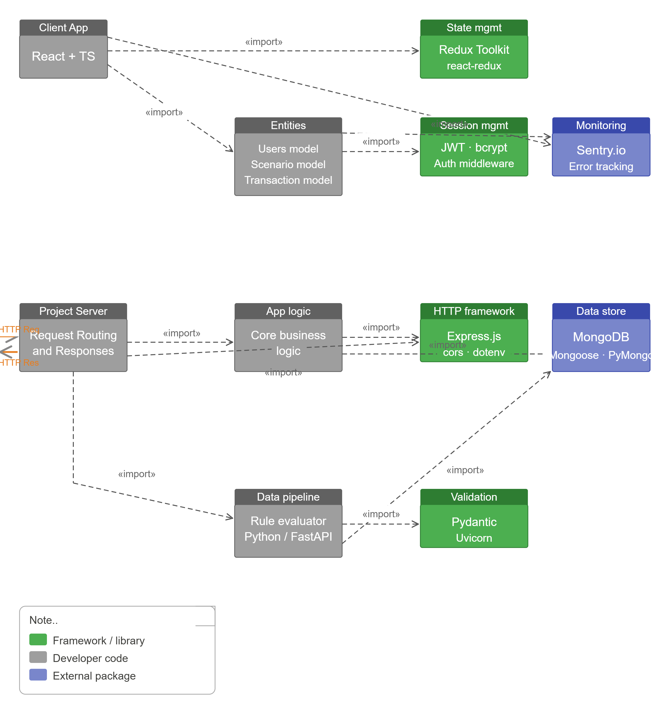

# FinGuard — Financial Crime Scenario Builder

A full-stack monorepo application for defining custom alert scenarios, 
processing transactions through a rule-based pipeline, and investigating 
flagged activity in real time.

> Currently in development — Day 1 of build log below.

---

## Author

Built by **Syed Aaqil Abbas**  
MASc Software Engineering — Memorial University of Newfoundland

- Portfolio: [syedaaqilabbas.vercel.app](https://syedaaqilabbas.vercel.app)  
- GitHub: [github.com/saabbas572](https://github.com/saabbas572)

---

## Planned Stack

React · TypeScript · Redux Toolkit · Vite · Node.js · Express · 
MongoDB · Python · FastAPI · Docker · Sentry · AWS · GitHub Actions

---

## Architecture Diagram

The diagram illustrates the FinGuard monorepo architecture. The React frontend in `client/vite-project` communicates with the Express backend under `server`, while the `pipeline` directory is reserved for the future Python transaction-processing service. MongoDB stores user and alert data, and Docker is used to compose the frontend, backend, and database services. The diagram also highlights external integrations for monitoring, auth, and data pipelines at a high level.

---

## Development Log

### Day 1 — Monorepo Scaffold & Project Initialization
**Date:** June 10, 2026

Initialized the monorepo using npm workspaces with `client` and `server` 
workspaces and a `pipeline` directory reserved for the Python service. 
Added `concurrently` at the root to run both services in parallel with 
a single command.

Scaffolded the client using Vite with the React TypeScript + SWC template. 
Installed Redux Toolkit, React Router, and Axios.

Scaffolded the server with Express, Mongoose, JWT, bcrypt, dotenv, and cors. 
Configured TypeScript with `ts-node` and `nodemon` for development.

Created `docker-compose.yml` to orchestrate MongoDB, the Node.js backend 
on port 5000, and the React frontend on port 3000.

**Libraries added today:** `react`, `react-dom`, `typescript`, `vite`, 
`@vitejs/plugin-react-swc`, `@reduxjs/toolkit`, `react-redux`, 
`react-router-dom`, `axios`, `express`, `mongoose`, `jsonwebtoken`, 
`bcryptjs`, `dotenv`, `cors`, `ts-node`, `nodemon`, `concurrently`

**Next:** MongoDB connection, User model, first auth route (`/api/auth/register`)

**What I learned:**
- How to organize a TypeScript monorepo with separate frontend and backend workspaces.
- How to scaffold a Vite React app and an Express server together.
- How to use Docker and `concurrently` to run both services locally.

### Day 2 — Auth API + MongoDB Integration
**Date:** June 11, 2026

Connected the Express backend to MongoDB using `mongoose` and environment-based URI configuration. Added a `User` model with `name`, `email`, hashed `password`, `role`, and timestamps.

Implemented `/api/auth/register` and `/api/auth/login` routes with password hashing via `bcryptjs`, JWT issuance with `jsonwebtoken`, and controller logic for registration and login.

Added `/health` for service readiness, plus server startup configuration with `dotenv`, `cors`, and JSON body parsing.

**Completed today:** Backend auth flow, database integration, user schema, register/login controllers, and API routing.

**Next:** Protected routes, Redux auth slice, and scenario builder UI.

**What I learned:**
- How to connect Express to MongoDB with Mongoose and handle env-based configuration.
- How to build registration and login flows with bcrypt password hashing and JWT authentication.
- How to structure controllers and API routes for auth functionality.

### Day 3 — Tailwind Integration & Auth UI
**Date:** June 12, 2026

Installed Tailwind CSS into `client/vite-project` and added PostCSS configuration so Vite can process Tailwind utilities.

Configured `tailwind.config.js` to scan `./index.html` and `./src/**/*.{js,ts,jsx,tsx}`. Imported Tailwind directives in `src/index.css` and used `@apply` for shared auth-card layout styles.

Updated the login and register pages to use Tailwind utility classes directly in JSX, including responsive layout, styled input fields, and button states.

**Completed today:** Tailwind install, Tailwind/PostCSS config, global Tailwind CSS setup, and login/register page styling.

**Next:** Extend the Tailwind-based design system to dashboard components, add auth form validation feedback, and build the scenario builder interface.

**What I learned:**
- How to install and configure Tailwind CSS in a Vite React application.
- How to use Tailwind utility classes for responsive auth page layout and styling.
- How to integrate PostCSS and keep styles maintainable with shared utility classes.

### Day 4 — Protected Routes & Auth Integration
**Date:** June 13, 2026

Started implementing auth middleware and protected backend routes for the Express API. Added a Redux auth slice in the client and connected login/register forms to the backend auth API.

Created protected client routes with route guards, and began scaffolding the dashboard layout that will host the scenario builder. Added client-side form validation feedback for login and registration, with a cleaner summary-based UI and invalid-field highlighting.

**Completed today:** Auth middleware, protected API route structure, Redux auth slice, frontend auth flow wiring, protected dashboard route, and auth form validation/feedback.

**Next:** Complete dashboard pages, build scenario/rule creation UI, and expand the protected scenario builder interface.

**What I learned:**
- How to protect Express routes with JWT auth middleware.
- How to manage auth state in Redux and connect it to the React app.
- How to create protected client routes for authenticated pages.
- How to add validation feedback without cluttering the auth form UI.

---

### Day 5 — Scenario Builder & Dashboard Expansion
**Date:** June 15, 2026

Added a protected Scenario Builder page to the React frontend and wired it into routing. Built a local scenario template editor that saves rules in local storage, with category selection, condition input, threshold entry, and active/inactive status.

Updated the dashboard to link to the new scenario builder and refined the next-steps section to reflect rule-template creation.

**Completed today:** Scenario Builder page, protected `/builder` route, dashboard navigation, local scenario persistence, and updated development log.

**Next:** Add backend scenario storage, build rule execution pipelines in `pipeline`, and surface rule metrics with dashboard charts.

**What I learned:**
- How to structure a scenario builder UI for alert rule creation.
- How to persist user-defined templates client-side with localStorage.
- How to connect feature navigation between dashboard and builder pages.

---

## Development Summary

| Day | Expected | Done | Challenges |
| --- | --- | --- | --- |
| Day 1 | Scaffold monorepo, setup client/server, configure workspaces and Docker. | Initialized the repo, created `client` and `server`, scaffolded Vite React and Express backend, added TypeScript tooling and Docker compose. | Coordinating workspace structure and TypeScript config across frontend and backend. |
| Day 2 | Build auth API with MongoDB integration, user model, and login/register routes. | Connected backend to MongoDB, created user schema, implemented `/api/auth/register` and `/api/auth/login`, added health check and middleware. | Ensuring secure password hashing, JWT handling, and environment-based database config. |
| Day 3 | Integrate Tailwind into React client and style auth pages. | Installed Tailwind, configured PostCSS, imported Tailwind directives, and converted login/register UI to Tailwind utilities. | Wiring Tailwind into the Vite build and updating the auth UI without conflicting existing CSS. |
| Day 4 | Protect auth routes, connect frontend login flow, and start dashboard scaffolding. | Implemented auth middleware and protected API routes, added Redux auth slice, wired UI auth flow, and scaffolded protected dashboard route. | Coordinating stateful auth flow across backend middleware and frontend route guards. |

