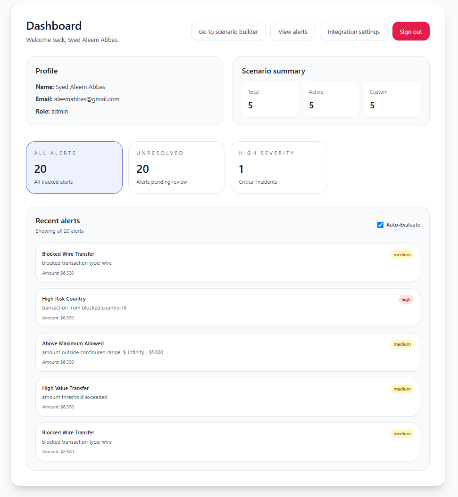

# FinGuard Frontend

This is the React + TypeScript frontend for the FinGuard financial risk monitoring platform.

## App overview

The frontend allows users to:
- sign in and manage secure access
- view the dashboard summary
- create and manage custom transaction risk scenarios
- review alerts by status and severity
- inspect transaction details for investigation workflows

## Screenshots

### Dashboard

The dashboard gives an overview of total alerts, unresolved items, and active scenarios.

### Alerts

The alert screen helps users review triggered events and filter the list by severity or date.

### Scenario Builder

This builder is used to create custom rules such as blocked countries, blocked transaction types, and amount thresholds.

### Create Scenario

Users can define new risk scenarios and assign severity levels before activating them.

### Alert Details

The detail view shows the exact reason an alert fired and the transaction context for investigation.

## Tech stack

- React
- TypeScript
- Vite
- Tailwind CSS
- React Router
- Axios
